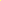

# City Skyline

[](../../README.md)
[](../../docs/getting-started/compatibility.md)
[](#)
[](../../docs/configuration/legacy-format.md)

An urban nightscape with layered buildings, stars, and atmospheric depth.




## How To Use

- Run with the included legacy configuration:
  ```bash
  ./hyprlax --config examples/city/parallax.conf
  ```
- Optional: convert to TOML for easier tweaking:
  ```bash
  ./hyprlax ctl convert-config examples/city/parallax.conf examples/city/hyprlax.toml --yes
  ./hyprlax --config examples/city/hyprlax.toml
  ```

## Dependencies

- hyprlax (built or installed)
- Wayland compositor (Hyprland, Sway, Wayfire, Niri, River, …)

## What You’ll Learn

- Using blur to simulate atmospheric perspective
- Layer ordering for convincing depth
- Picking shift multipliers that match real-world scale

## Goal Of The Example

Deliver a cinematic city night scene with multiple skylines that move at different speeds.

## Configuration Walkthrough

- Layers (back → front):
  1) `layer0_sky.png` — static night sky (0.0)
  2) `layer1_stars.png` — very slow drift (0.1)
  3) `layer2_far_skyline.png` — heavy blur, slow (0.3)
  4) `layer3_mid_skyline.png` — moderate blur, medium (0.5)
  5) `layer4_near_skyline.png` — slight blur, faster (0.8)
  6) `layer5_street.png` — sharp, normal speed (1.0)
- Global animation (legacy): `duration 1.2`, `shift 180`, `easing expo`

## Customization Tips

- Increase star layer opacity for clearer skies
- Adjust skyline blur to taste based on your display size
- Try `duration 1.5` for a slower, moodier transition

## Image Placeholders

- Add a screenshot as `examples/city/screenshot.png`
- Add a layer diagram as `examples/city/layers.png`
